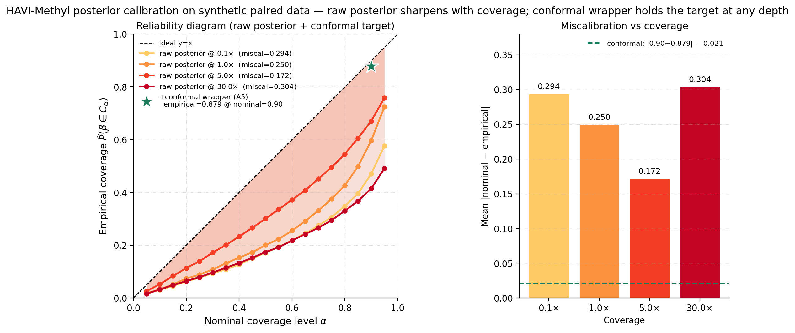

# Figure gallery

All nine figures shipped in `docs/website/assets/figures/`, with the
underlying CSV / npz artifact each one reads.

## Liu 2024 paired methylation

### `finaleme_paired_metrics.png`

Pearson $r$ (left) and credible-interval ECE (right) on the Liu 2024
paired cfDNA → WGBS panel. **Source:**
[`docs/report/tables/bench_finaleme_realdata.csv`](https://github.com/osolari/HAVI-Methyl/blob/main/docs/report/tables/bench_finaleme_realdata.csv);
script `scripts/fig_finaleme_paired_metrics.py`.

### `finaleme_paired_scatter.png`

Per-locus prediction density (hexbin) for each method on the same
60 214 $(s,\ell)$ points. **Source:** the same Liu 2024 paired panel
output read directly from the bench script's intermediate arrays;
script `scripts/fig_finaleme_paired_scatter.py`.

### `finaleme_coverage_strat.png`

Per-stratum Pearson $r$ vs WGBS truth — HAVI is the only method with
positive correlation in every stratum. **Source:**
[`outputs/tables/bench_finaleme_coverage_strat.csv`](https://github.com/osolari/HAVI-Methyl/blob/main/outputs/tables/bench_finaleme_coverage_strat.csv);
script `scripts/fig_finaleme_coverage_strat.py`.

## Loyfer tissue-of-origin

### `loyfer_loo_rmse.png`

LOO RMSE on the Loyfer U25 panel — variance-weighted Dirichlet head is
best on every reported axis. **Source:**
[`outputs/tables/bench_tissue_loo.csv`](https://github.com/osolari/HAVI-Methyl/blob/main/outputs/tables/bench_tissue_loo.csv);
script `scripts/fig_loyfer_loo_rmse.py`.

### `loyfer_loo_per_tissue.png`

Per-tissue LOO RMSE for each method, sorted by HAVI's advantage over
continuous lstsq. HAVI wins all 36/36. **Source:**
[`docs/report/tables/bench_loyfer_loo_per_tissue.csv`](https://github.com/osolari/HAVI-Methyl/blob/main/docs/report/tables/bench_loyfer_loo_per_tissue.csv);
script `scripts/fig_loyfer_loo_per_tissue.py`.

## Synthetic recovery

### `recovery_scatter.png`

2×4 hexbin grid of true vs predicted $\beta$ across $\{0.1\times,
1\times, 5\times, 30\times\}$ coverage. **Source:**
`outputs/plot_data.npz`; script `scripts/fig_recovery_scatter.py`.

### `multiseed_recovery.png`

$N=20$-seed Pearson $r$ vs fragment-bag coverage with 90 % bootstrap
bands. **Source:**
[`docs/report/tables/tab_recovery_multiseed.csv`](https://github.com/osolari/HAVI-Methyl/blob/main/docs/report/tables/tab_recovery_multiseed.csv);
script `scripts/fig_multiseed_recovery.py`.

### `calibration.png`

Reliability diagram + miscalibration inset; the green star is the A5
conformal-wrapper measured pair $(0.879, 0.69)$. **Source:**
`outputs/plot_data.npz` + the A5 row of
[`bench_ablation_matrix.csv`](https://github.com/osolari/HAVI-Methyl/blob/main/docs/report/tables/bench_ablation_matrix.csv);
script `scripts/fig_calibration.py`.

### `elbo_trajectory.png`

ELBO + per-iteration Pearson $r$ from the real Liu 2024 torch SVI run
on a single A10G GPU ($500$ iterations); final $r = 0.467$ matches the
headline real-data row. **Source:** the `TorchSVIState.elbo_history` and
`snapshots` of the real-data bench, captured by `--torch-snapshot-every 20`;
script `scripts/fig_elbo_trajectory.py`.
